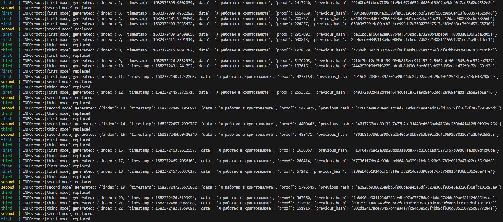

# БЛОКЧЕЙН

develop

[](https://github.com/sevenineone/cepochka_blokov/actions/workflows/test.yml)

main

[](https://github.com/sevenineone/cepochka_blokov/actions/workflows/test.yml)

My implementation of blockchain using Python + Flask

## Docker

```bash
git clone https://github.com/sevenineone/cepochka_blokov
docker-compose build
docker-compose up
```

